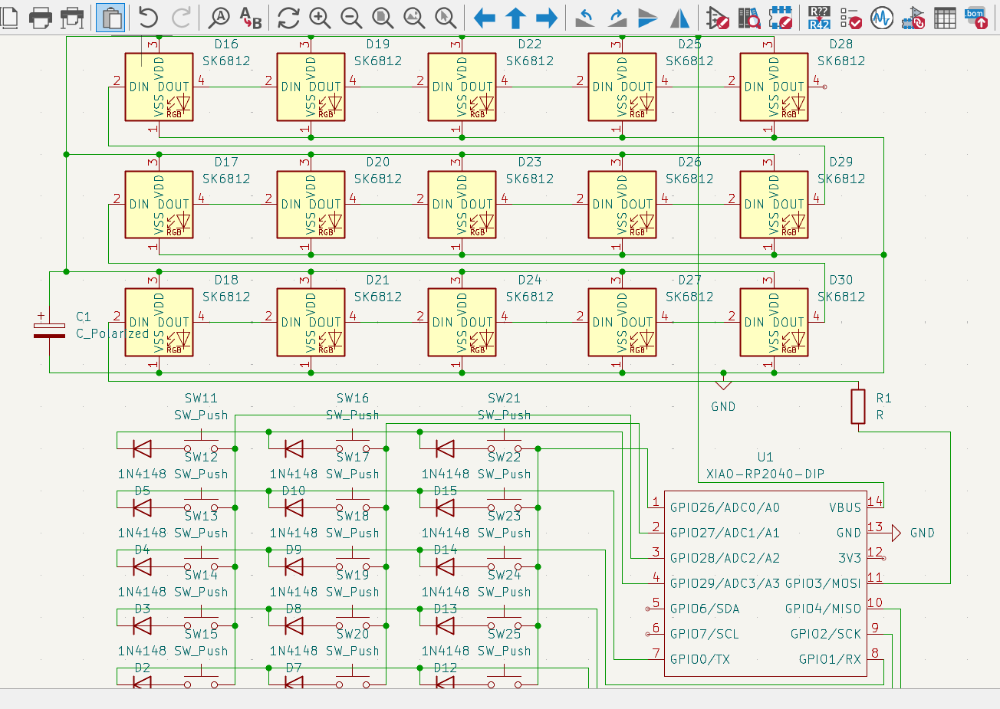
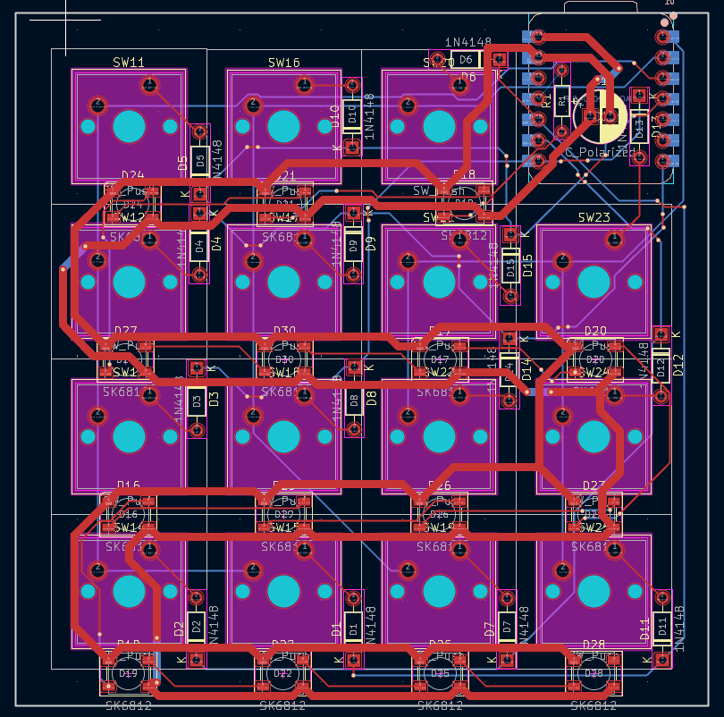
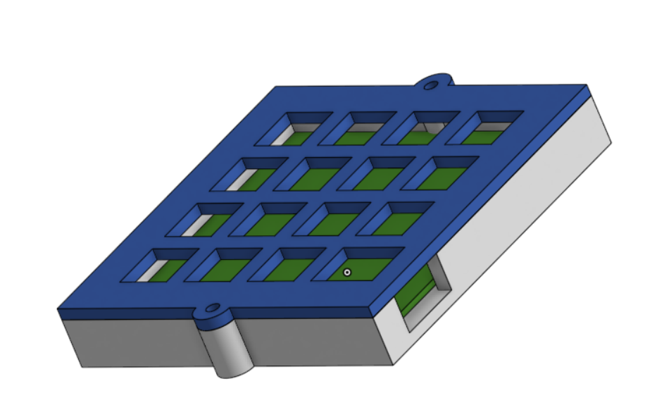

# 3×5 CAD Shortcut Keyboard

A compact 15-key USB shortcut keyboard designed to trigger shortcuts in CAD software.  
Built around a **Seeed XIAO RP2040 (DIP version)** using a **3×5 diode-protected key matrix** (anti-ghosting).

This repo contains the full hardware + firmware stack: schematic, PCB layout, assembly references, and firmware that sends USB key events to the computer.

---

## Repository Structure

- **PCB/**: KiCad project files (schematic + PCB layout)
- **Firmware/**: firmware source code
- **docs/**: screenshots used in this README

---

## Hardware Overview

### Purpose
CAD workflows rely heavily on shortcuts (sketch tools, constraints, navigation, etc.). A full keyboard works, but it increases hand travel and breaks focus. This small keyboard provides **15 dedicated keys** mapped to the most-used CAD actions.

### Main Characteristics
- 15 keys total
- 3 rows × 5 columns matrix
- 1 diode per key (ghosting prevention)
- USB connection via XIAO RP2040
- Optional per-key RGB backlight (SK6812 addressable LEDs)
- PCB constrained to **≤ 100 mm × 100 mm**

---

## Schematic

---

## Key Matrix

The keys are wired as a matrix to reduce GPIO usage:
- Rows configured as **outputs**
- Columns configured as **inputs with pull-ups**
- Each key uses **one series diode** to prevent ghosting during matrix scanning

Electrical structure per key:

~~~text
ROW → diode → switch → COLUMN
~~~

Diode orientation rule used in this design:
- **Diode stripe faces the row net** (cathode on the row side)

This allows columns to be pulled low when a row is driven low and a switch is pressed.

---

## GPIO Pin Mapping (Seeed XIAO RP2040)

### Rows (outputs)

| Row | GPIO |
|-----|------|
| R0  | GPIO26 |
| R1  | GPIO27 |
| R2  | GPIO28 |

### Columns (inputs with pull-ups)

| Column | GPIO |
|--------|------|
| C0     | GPIO29 |
| C1     | GPIO0  |
| C2     | GPIO1  |
| C3     | GPIO2  |
| C4     | GPIO4  |

### Optional RGB LED chain (SK6812)
- LEDs powered from **USB 5V (VBUS)** and **GND**
- Data from a free GPIO (example: **GPIO3**) into **LED1 DIN**
- Daisy-chain **DOUT → DIN** across all 15 LEDs

---

## PCB Layout

### Mechanical / Placement
- Key spacing: **19.05 mm** center-to-center (standard MX spacing)
- Board outline designed to fit within the **100×100 mm** maximum
- Switch footprint: `SW_Cherry_MX_1.00u_PCB`
- LEDs placed near each switch footprint (outside switch courtyard)
- Diodes placed close to switches (can be bottom-side to free space and simplify routing)

---

## Assembly

### Assembly Steps
1. Solder the diodes (verify stripe orientation toward row nets)
2. Solder the SK6812 LEDs (optional; verify DIN/DOUT direction)
3. Solder the Seeed XIAO RP2040 module
4. Solder the MX switches
5. Flash the firmware
6. Connect over USB and validate key presses and shortcuts

---

## Firmware

Firmware location:

~~~text
Firmware/main.py
~~~

This project uses **CircuitPython** with a **KMK-style** approach (single `main.py`).  
The firmware scans the 3×5 matrix and sends USB keyboard events to the host computer. Keys are currently mapped to **placeholder shortcuts** that can be replaced with the exact shortcuts used by your CAD tool.

---

## BOM (Bill of Materials)

### Core (required)

| Item | Qty | Notes |
|------|-----|------|
| Seeed Studio XIAO RP2040 (DIP) | 1 | Main controller, USB-C |
| Custom PCB (≤100×100 mm) | 1 | From this repo KiCad files |
| Cherry MX compatible switches | 15 | Any MX-style (linear/tactile/clicky) |
| Keycaps (1u) | 15 | Any MX keycap set |
| Signal diodes | 15 | **1 per key** (ex: 1N4148 THT or 1N4148W SMD) |
| USB cable (USB-C) | 1 | For power + data |

### Optional (RGB backlight)

| Item | Qty | Notes |
|------|-----|------|
| SK6812 / NeoPixel-compatible addressable LEDs | 15 | Per-key RGB (choose SMD package that matches footprint) |
| Decoupling capacitor for LED power rail | 1–2 | Typical: 100 µF electrolytic + 0.1 µF ceramic near LED rail |
| Series resistor on LED data line | 1 | Typical: 330–470 Ω between GPIO and first LED DIN |

### Optional (mechanical)

| Item | Qty | Notes |
|------|-----|------|
| Case / plate (3D printed or laser cut) | 1 | If you want a rigid enclosure |
| Rubber feet | 4 | Desk grip |
| M2 / M3 screws + standoffs | 4–8 | Depends on case design |

---

## Intended Shortcut Usage (Example)

Typical categories to map:
- Sketch tools (line, rectangle, circle)
- Constraints (coincident, parallel, perpendicular)
- Navigation (pan, zoom, rotate, view presets)
- Editing (copy, paste, undo, redo)
- Utilities (measure, save)
